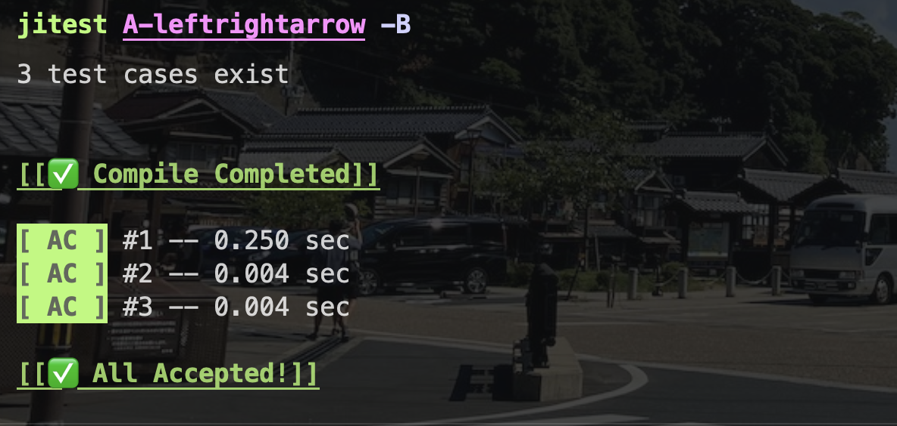
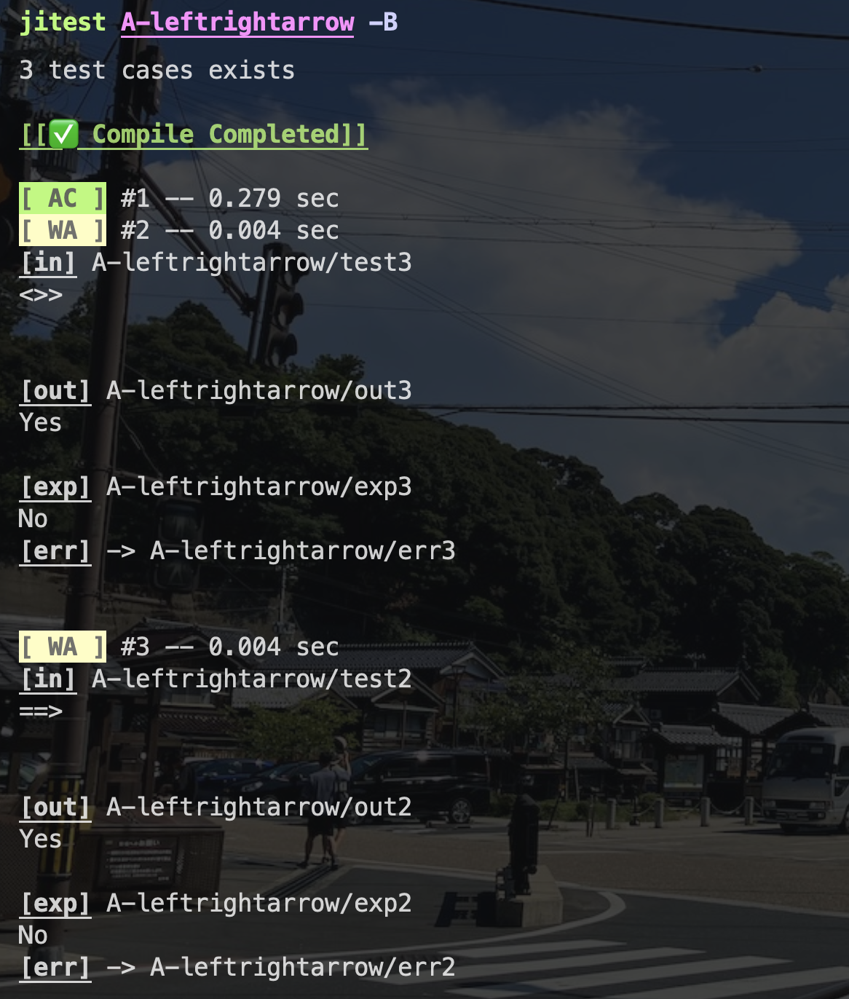

# jitest




1つのファイルで完結するようなプログラムを実行・テストするためのシンプルなツールです。現状はC++での実行（g++でのコンパイル）だけに対応しています。

基本的にはAtCoder Beginner Contestで自分が使うためのツールとして開発しています。

## 経緯
- zshで同一の機能を持つスクリプトを制作していた。
- メンテナンス・機能拡張に限界を感じたため、Rustに移植。
- ついでに便利そうな機能もいくつか付け加えた。

## 基本的な使用方法
```
jitest [OPTIONS] <target directory> 
```
- `<target directory>`には、入力例`test*`・出力例`exp*`・プログラム`p.cpp`を子に持つディレクトリを指定します。
  - (`test1`, `exp1`)のように、末尾の対応したファイル2つ組を1テストケースにおける入出力例とみなします。
  

より詳細には、以下の手順を踏んで実行されます。
1.  ユーザは入力例`test*`・出力例`exp*`・プログラム`p.cpp`を子に持つディレクトリの名前を引数に指定します。
2.  システムは「`testX`と`expX`のように、冒頭の`test`と`exp`を除いて共通した名を持つファイル二つ組」（e.x. `test1`と`exp1`）を対応した入力例と出力例としてみなします。
3.  以下の処理をそれらの組全てに対して行います。
    1.  プログラム`p.cpp`をコンパイルし、実行ファイルを出力します。
    2.  実行ファイルに対して入力例を標準入力に流し込んで、得られた標準出力を出力例と照合します。
    3. 実行の状態は以下のように示されます。背景色や文字の強調がつくため、知覚しやすくなっています。
        - `Compile Error` (コンパイル失敗)
        - `Runtime Error` (実行中エラー発生)
        - `WJ` (Waiting Judge; 実行・照合中)
        - `WA` (Wrong Answer; 照合にて差分を発見)
        - `AC` (Accepted; そのケースにおいて、出力例と一致した出力を示した。)
    
## オプション


## 他の機能
- 実行秒数を表示してくれたり
- 間違ってたら入出力例とそのデータが書かれたパスを示してくれたり
- `-B`オプションをつけると、差分取りにおいてスペース空行有りなしの違いを無視するようになったり
- `-d`オプションつけたら標準入力を手入力できるようになったり
  
とかのちょっぴり便利機能もつけています。